[Back to main Logbook Page](../hci_logbook.md)

---
# Low Fidelity Prototype and Evaluation

## D.1. Low Fidelity Prototype

Foi criada inicialmente uma primeira versão do protótipo de baixa fidelidade, de forma a obter feedback durante o processo de desenvolvimento. Após a análise funcional desta versão inicial, foi finalizado o protótipo de baixa fidelidade.

## Tarefa nº 1 - Visualizar e marcar eventos públicos:

"Quero visualizar eventos públicos na área" - carregar no botão Events
# 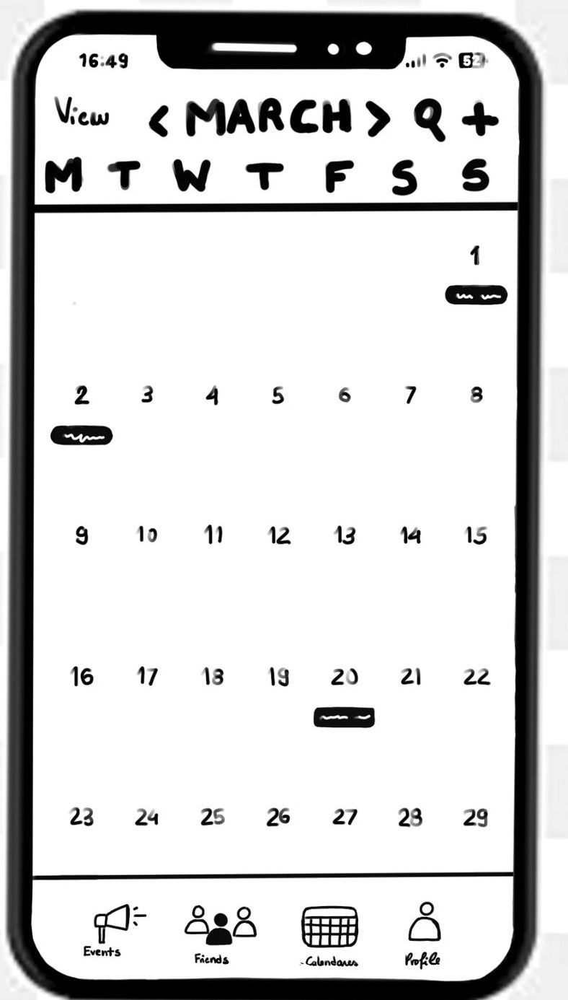
"Tenho interesse no concerto dos ABBA" - selecionar View no evento escolhido
# 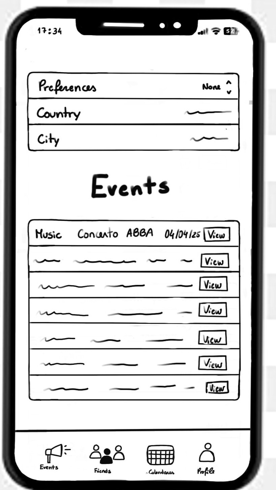
"Vou adicionar ao meu calendário" - carregar no botão Add
# 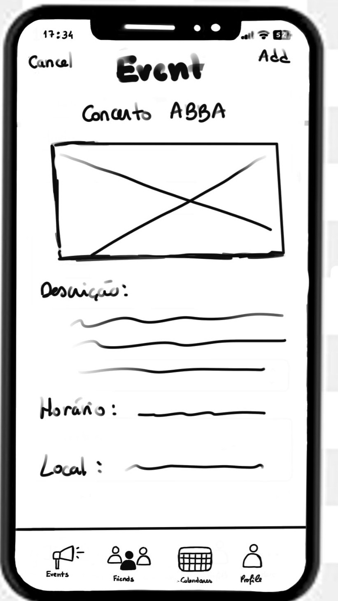
"Confirmo a marcação do evento" - Selecionar Confirm
# 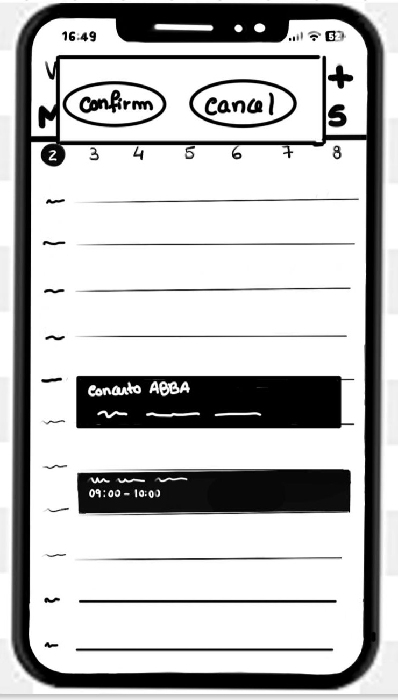

## Tarefa nº 2 - Criar e editar eventos:

"Quero ir ao cinema no dia 2 de março para ver o filme Flow, sessão 11h - 12h" - Carregar no botão adicionar evento 
# 
"Preencho as informações do evento" - preencher espaços de informação
# 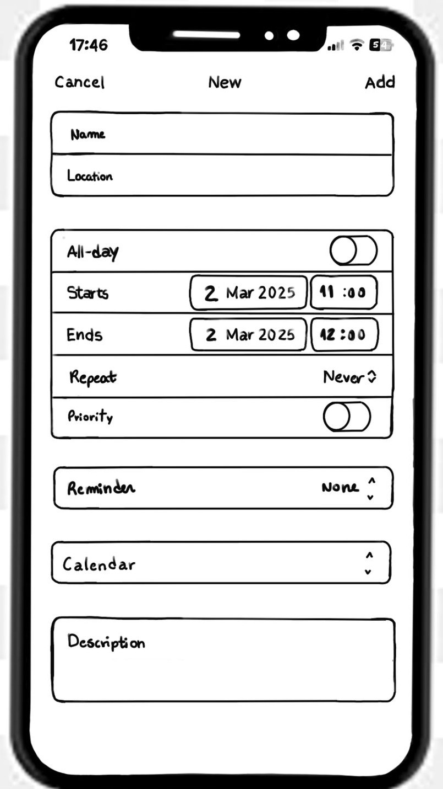
"O evento foi adicionado, mas afinal a sessão é às 9h" - selecionar evento no calendário
# 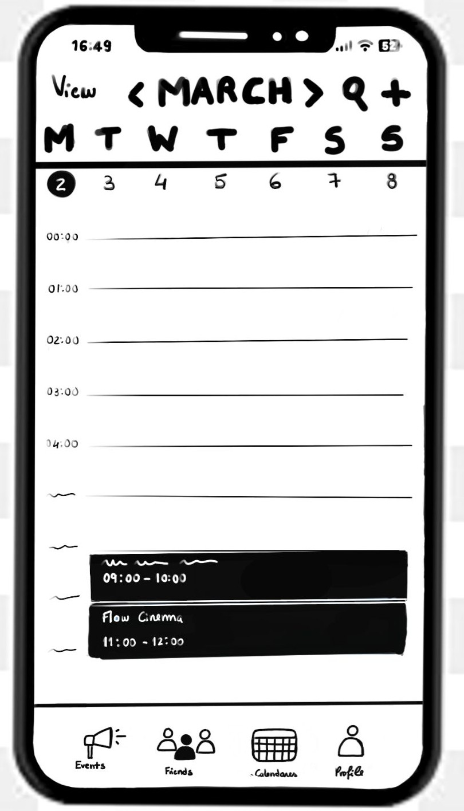
"Alterei as informações do evento" - Selecionar Edit e alterar as informações
# 
"Já existe um evento nessa hora, que quero remarcar" - Selecione Procede
# 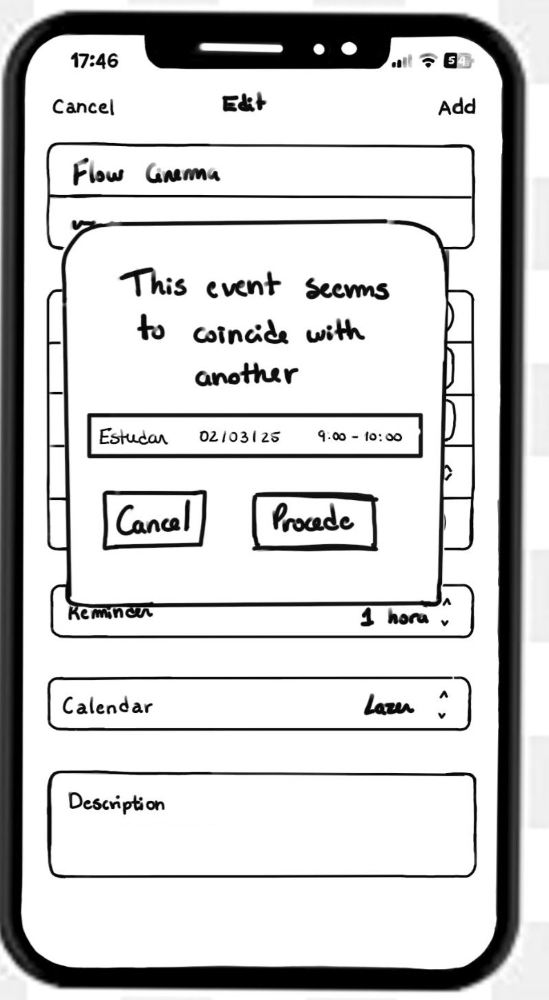
"Vejo as opções de remarcação e escolho a automática, mas quer ver no calendário primeiro" - Clique em Preview 
# 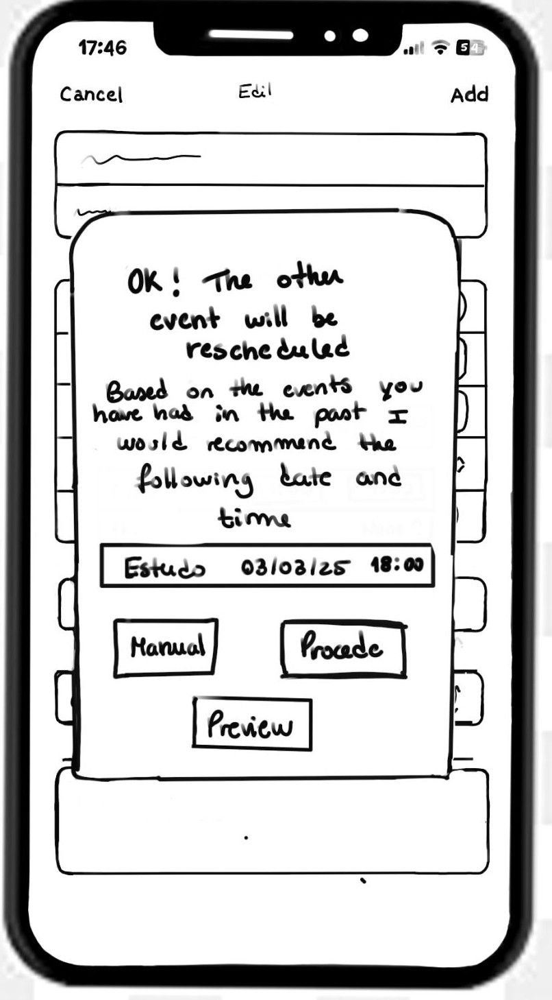
"Aceito o evento após ver a preview" - Carregar em Accept
# 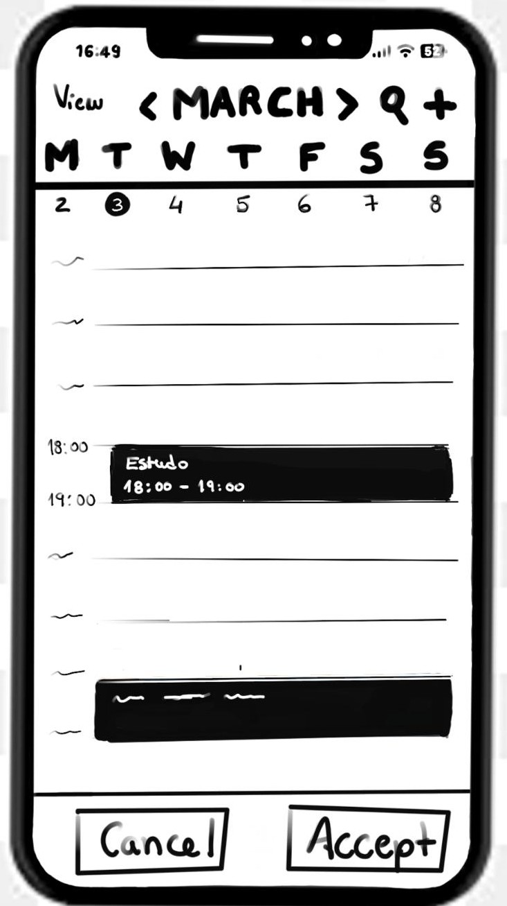

## Tarefa nº 3 - Receber partilhas de horários e marcar eventos partilhados:

"A Maria partilhou o seu horário para marcar um almoço, e quero analisar" - 1ª opção: Selecionar Friends; 2ª opção: Carregar na notificação
# 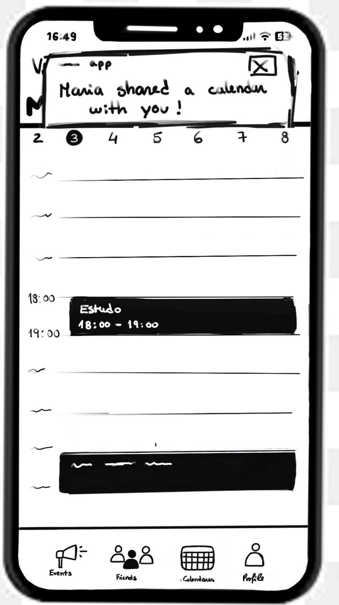
1ª opção: "Quero ver o horário partilhado pela Maria" - Selecione Accept
# 
"Dos blocos livres apresentados, prefiro dia 27" - Carregar no bloco correspondente na coluna do dia 27
# 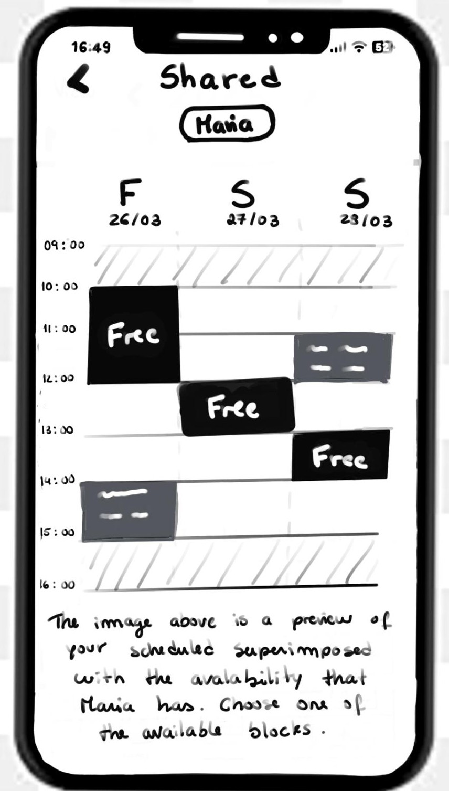
"Quero aceitar a marcação" - Aprovar carregando no botão Add
# 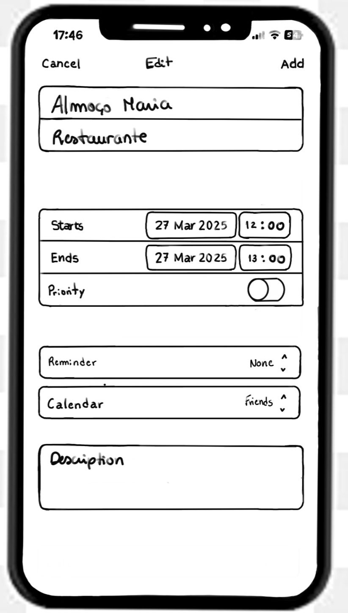
"Recebo confirmação da marcação e sou levado para a página do dia com o evento já marcado"
# 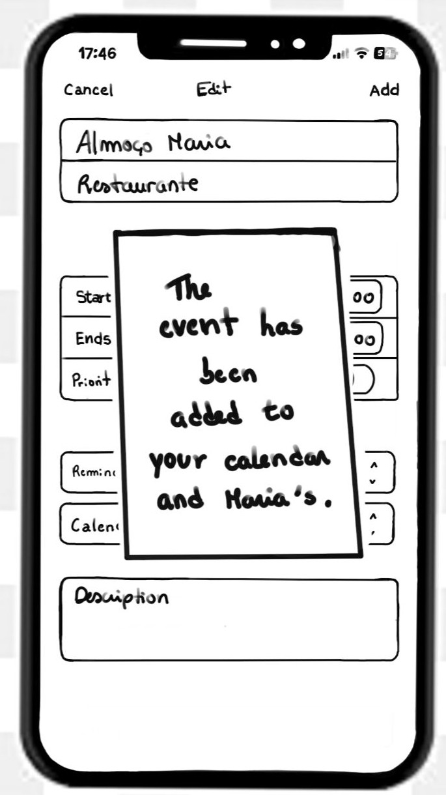
# 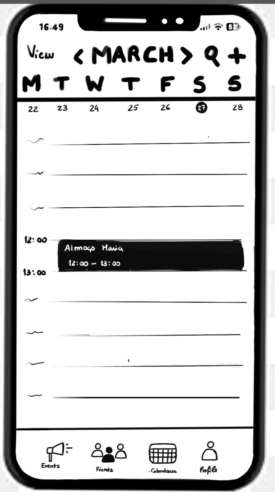

## Tarefa nº 4 - Partilhar horário com um amigo:

"Quero partilhar os dias 13, 14 e 15 de março" - selecionar e arrastar do dia 13 a 15 e carregar Share
# 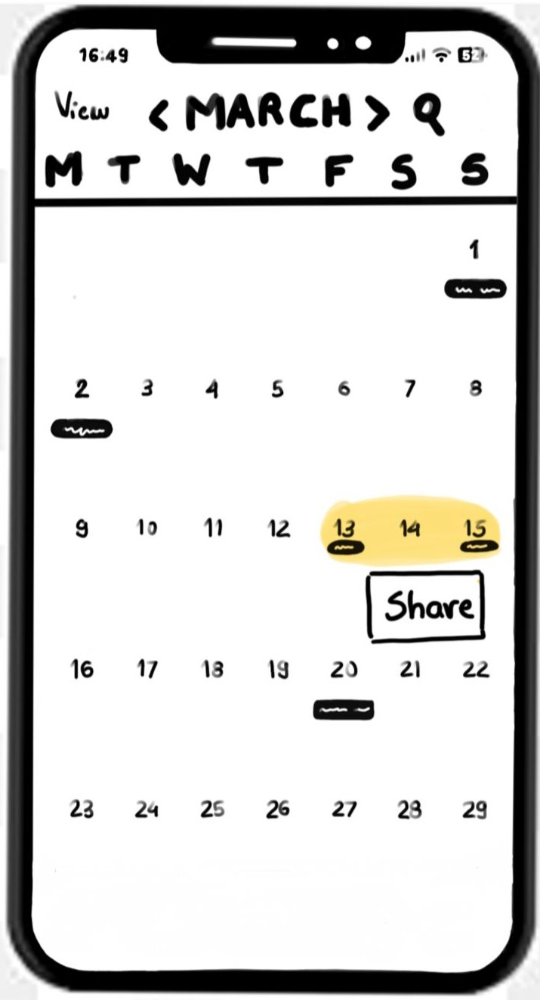
"Quero partilhar estes dias com o João" - Clicar em Share na caixa relativa a João
# 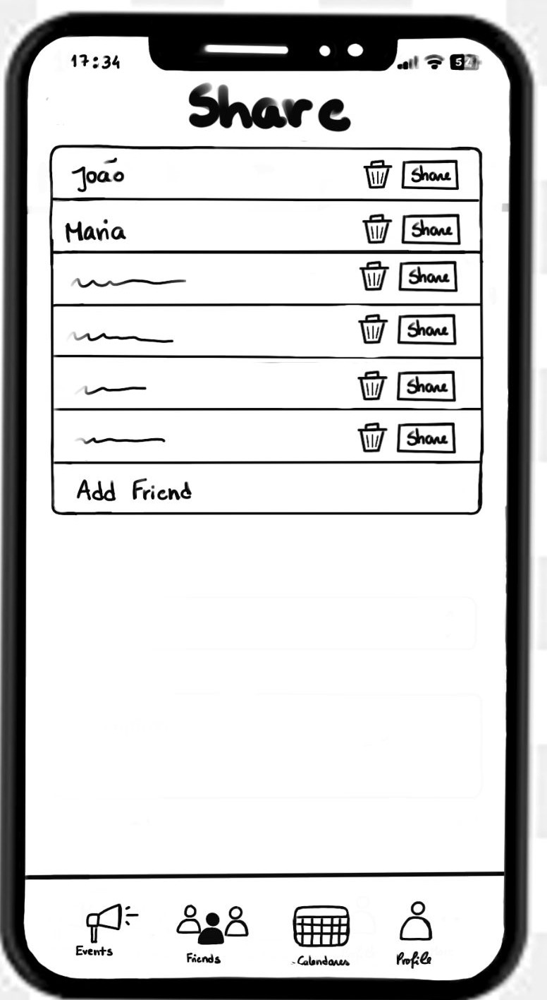
"Visualizo e confirmo as datas e blocos horários partilhados" - Selecionar Done
# 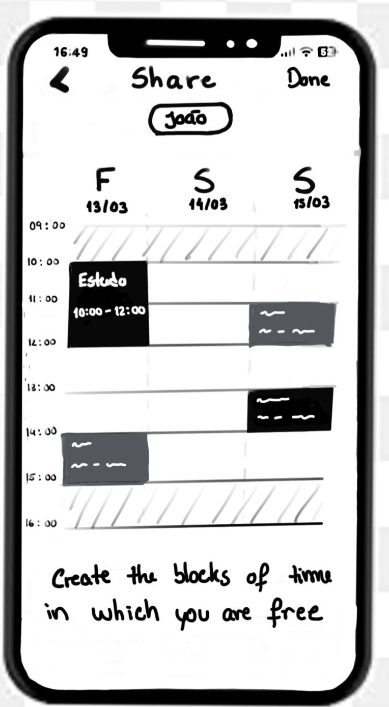
"Recebo confirmação da partilha efetuada"
# 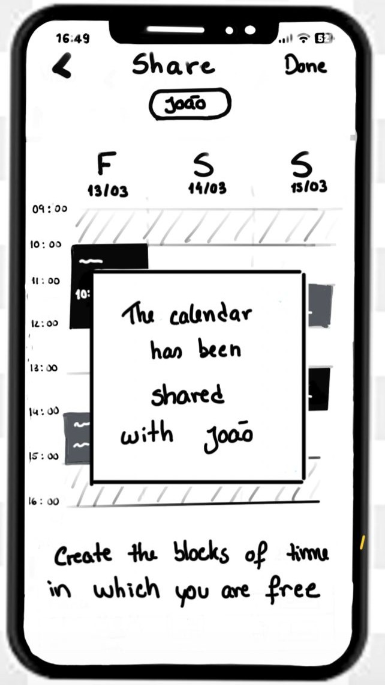

## D.2. Prototype Evaluation

---
[Back to main Logbook Page](../hci_logbook.md)

---